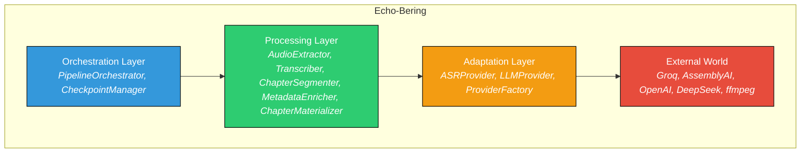

# Diagrama de Componentes

Echo-Bering sigue una arquitectura de 4 capas con separación estricta de responsabilidades y patrón provider-as-visitors.

**Propósito:** Mostrar la arquitectura interna del sistema y la separación entre orquestación, procesamiento, adaptación y mundo externo.

## Descripción de Componentes

| Componente | Responsabilidad | Implementación |
|------------|-----------------|----------------|
| Orchestration Layer | Coordina el flujo completo del pipeline, maneja checkpoints y reanudación | `PipelineOrchestrator`, `CheckpointManager` |
| Processing Layer | Lógica de dominio agnóstica de proveedores: extracción, transcripción, segmentación, enriquecimiento, materialización | `AudioExtractor`, `Transcriber`, `ChapterSegmenter`, `MetadataEnricher`, `ChapterMaterializer` |
| Adaptation Layer | Traduce entre el dominio interno y APIs externas, implementa patrón provider-as-visitors | `ASRProvider` (Groq, AssemblyAI, OpenAI), `LLMProvider` (DeepSeek, Groq, OpenAI) |
| External World | Servicios y herramientas externas utilizadas por el sistema | APIs de proveedores, ffmpeg para operaciones de video/audio |

## Principios Arquitectónicos

- **Transcripción como contrato único de verdad**: Todo el pipeline se basa en la transcripción generada
- **Proveedores como visitantes**: La lógica core es completamente agnóstica de los proveedores específicos
- **Capítulo como unidad atómica de valor**: Solo se generan outputs completos, nunca parciales
- **Filesystem como base de datos**: No se introduce capa de persistencia adicional