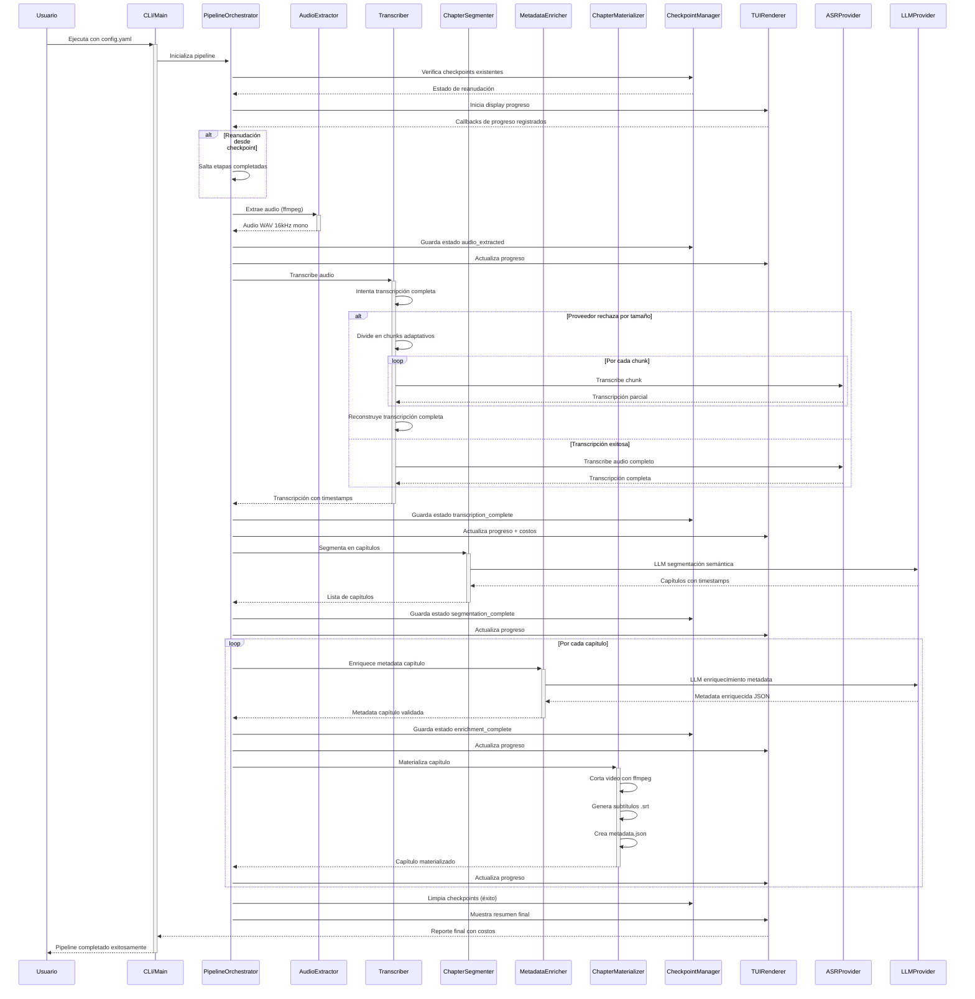

# Pipeline Principal

Flujo completo del pipeline de procesamiento de Echo-Bering desde la entrada de video hasta la generación de capítulos estructurados.

**Propósito:** Documentar el flujo principal de ejecución del sistema y las interacciones entre componentes.

**Endpoint:** CLI `python -m src.main --config config.yaml`

## Fases del Flujo

1. **Inicialización**: Carga configuración, verifica checkpoints existentes, inicializa TUI
2. **Extracción de Audio**: Convierte video input a audio WAV mono 16kHz usando ffmpeg
3. **Transcripción Adaptativa**: Intenta transcripción completa, fallback a chunks si proveedor rechaza
4. **Segmentación Semántica**: Usa LLM para dividir transcripción en capítulos temáticos coherentes  
5. **Enriquecimiento por Capítulo**: Para cada capítulo, usa LLM para generar metadata enriquecida
6. **Materialización**: Genera cortes físicos de video, subtítulos .srt y archivos metadata.json
7. **Finalización**: Limpia checkpoints, muestra resumen final con costos y estadísticas

## Consideraciones

- **Chunking Adaptativo**: Solo se aplica cuando el proveedor rechaza el audio completo por límites técnicos
- **Reanudación**: El sistema puede reanudar desde cualquier checkpoint guardado después de fallos
- **Costos en Tiempo Real**: El TUI muestra costos acumulados y estimación final durante la ejecución
- **Manejo de Errores**: Fallos parciales (chunks fallidos) no detienen el pipeline completo
- **Validación de Outputs**: Todos los JSON generados por LLM se validan contra esquemas Pydantic
- **Límites de Presupuesto**: El pipeline se detiene si los costos acumulados exceden el presupuesto configurado