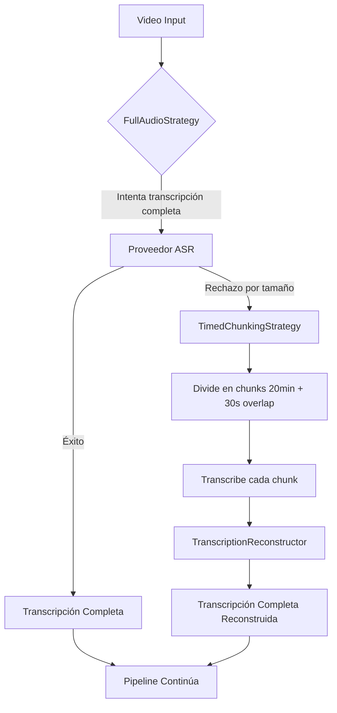

# Adaptive Chunking

Estrategia de chunking adaptativo que permite procesar videos largos respetando los límites técnicos de los proveedores ASR mientras mantiene la coherencia semántica.

**Propósito:** Implementar el principio "La transcripción es un contrato, no un subproducto" permitiendo procesar videos de cualquier duración sin perder calidad en los bordes de chunks.

## Componentes Clave

| Componente | Responsabilidad | Archivo |
|------------|-----------------|---------|
| `ChunkingManager` | Orquesta estrategias de chunking | [`src/processors/chunking.py`](src/processors/chunking.py) |
| `FullAudioStrategy` | Intenta transcripción completa primero | [`src/processors/chunking.py`](src/processors/chunking.py) |
| `TimedChunkingStrategy` | Divide en chunks temporales con solapamiento | [`src/processors/chunking.py`](src/processors/chunking.py) |
| `TranscriptionReconstructor` | Reconstruye transcripción completa desde chunks | [`src/processors/transcription_reconstructor.py`](src/processors/transcription_reconstructor.py) |

## Diagrama de Arquitectura

## Flujo de Operación

1. **Intento Inicial**: `FullAudioStrategy` intenta transcribir el audio completo
2. **Detección de Rechazo**: Si el proveedor rechaza por límites técnicos (duración/tamaño), se lanza `ProviderSizeLimitError`
3. **Fallback Adaptativo**: `TimedChunkingStrategy` divide el audio en chunks de 20 minutos con 30 segundos de solapamiento
4. **Transcripción Paralela**: Cada chunk se transcribe independientemente (con reintentos y fallbacks)
5. **Reconstrucción Inteligente**: `TranscriptionReconstructor`:
   - Calcula timestamps absolutos para cada palabra
   - Resuelve regiones de solapamiento usando scores de confianza más altos
   - Marca chunks fallidos como `[TRANSCRIPTION_FAILED]` pero continúa procesando
6. **Validación Final**: La transcripción reconstruida se valida para asegurar integridad temporal

## Configuración

| Propiedad | Default | Descripción |
|-----------|---------|-------------|
| `chunk_duration_minutes` | `20` | Duración base de chunks cuando se requiere división |
| `overlap_seconds` | `30` | Solapamiento entre chunks para evitar pérdida en bordes |
| `max_budget_usd` | `2.0` | Presupuesto máximo que afecta estrategia de chunking |

## Manejo de Casos Especiales

- **Chunks Fallidos**: Se marcan explícitamente pero no detienen el pipeline completo
- **Último Chunk Pequeño**: Si el último chunk es < 30% del tamaño normal, se fusiona con el anterior
- **Solapamiento en Bordes**: Las palabras en regiones de solapamiento usan el score de confianza más alto
- **Costos Acumulados**: Cada llamada a proveedor incrementa costos; se verifica presupuesto continuamente

## Beneficios de la Estrategia Adaptativa

- **Eficiencia**: Usa transcripción completa cuando es posible (más rápida, menos costosa)
- **Robustez**: Solo divide cuando es técnicamente necesario
- **Coherencia**: El LLM siempre recibe una transcripción completa para segmentación
- **Transparencia**: El usuario no necesita saber si se usaron chunks internamente
- **Optimización de Costos**: Minimiza llamadas API innecesarias

> **Filosofía:** "El chunking es una preocupación técnica, no una decisión lógica. La narrativa del video debe permanecer intacta independientemente de las limitaciones de infraestructura."