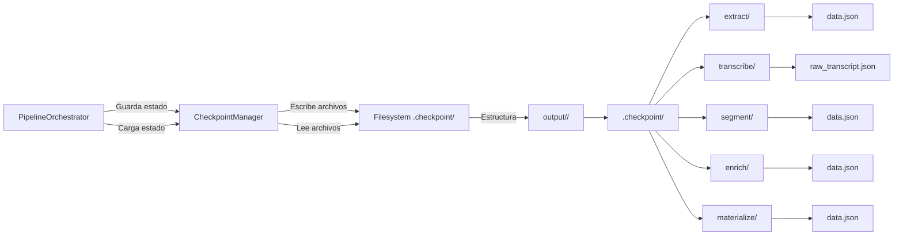

# Checkpointing Resumable

Sistema de checkpoints basado en filesystem que permite reanudar el pipeline desde cualquier punto de fallo sin perder trabajo previo.

**Propósito:** Implementar resiliencia y eficiencia permitiendo continuar procesamiento interrumpido sin repetir trabajo ya completado.

## Componentes Clave

| Componente | Responsabilidad | Archivo |
|------------|-----------------|---------|
| `CheckpointManager` | Gestiona operaciones de checkpoint | [`src/checkpoint/checkpoint_manager.py`](src/checkpoint/checkpoint_manager.py) |
| `PipelineOrchestrator` | Coordina checkpoints con ejecución | [`src/orchestrators/pipeline.py`](src/orchestrators/pipeline.py) |
| `PipelineState` | Representa estado del pipeline | [`src/utils/progress.py`](src/utils/progress.py) |

## Diagrama de Arquitectura



## Flujo de Operación

### Inicialización
1. **Generación de Video ID**: Hash del path + timestamp para identificación única
2. **Verificación de Checkpoints**: Buscar directorio `.checkpoints/<video_id>/`
3. **Determinación de Etapa**: Identificar última etapa completada exitosamente
4. **Salto de Etapas**: Omitir etapas ya completadas en la ejecución actual

### Guardado de Checkpoints
1. **Post-Etapa Exitosa**: Después de completar cada etapa principal
2. **Serialización de Estado**: Convertir objetos Pydantic a JSON
3. **Escritura Atómica**: Guardar en filesystem con nombres descriptivos
4. **Actualización de Estado**: Registrar etapa completada en `processing_state.json`

### Reanudación
1. **Carga de Estado**: Leer todos los archivos de checkpoint disponibles
2. **Validación de Integridad**: Verificar que los artefactos sean válidos
3. **Reconstrucción de Contexto**: Restaurar objetos necesarios para continuar
4. **Continuación**: Iniciar desde la primera etapa incompleta

## Estructura de Archivos

```
output/
└── <project_name>/                    # Ej: echo_bering_video_20m
    ├── .checkpoint/                   # Directorio de checkpoints
    │   ├── extract/                   # Etapa de extracción de audio
    │   │   └── data.json             # Metadata del audio extraído
    │   ├── transcribe/               # Etapa de transcripción
    │   │   └── data.json             # Datos de transcripción
    │   ├── asr/                       # Resultados del proveedor ASR
    │   │   └── raw_transcript.json   # Transcript crudo (preprocesado)
    │   ├── segment/                   # Etapa de segmentación
    │   │   └── data.json             # Capítulos segmentados
    │   ├── enrich/                    # Etapa de enriquecimiento
    │   │   └── data.json             # Capítulos enriquecidos
    │   └── materialize/              # Etapa de materialización
    │       └── data.json             # Metadata de outputs generados
    ├── chapters/                      # Directorio de capítulos generados
    │   ├── <chapter-slug-1>/
    │   │   ├── metadata.json
    │   │   ├── <chapter-slug-1>.srt
    │   │   └── <chapter-slug-1>.mp4
    │   └── <chapter-slug-2>/
    │       └── ...
    └── test_20m_video.mp4            # Video de entrada
```

## Processing State Schema

```json
{
  "video_id": "string",
  "current_stage": "string",
  "completed_stages": ["string"],
  "providers_used": {
    "asr": "string",
    "llm": "string"
  },
  "cost_accumulated": "number",
  "timestamps": {
    "started_at": "string",
    "audio_extraction_completed": "string",
    "transcription_completed": "string",
    "segmentation_completed": "string",
    "enrichment_completed": "string"
  }
}
```

## Consideraciones de Implementación

- **Atomicidad**: Los checkpoints se guardan de forma atómica para evitar estados corruptos
- **Persistencia por defecto**: Los checkpoints se conservan después de completar exitosamente (`keep_checkpoints: true`)
- **Ubicación organizada**: Los checkpoints se guardan en `output/<project_name>/.checkpoint/` junto con los outputs
- **Estructura por etapas**: Cada etapa tiene su propio directorio con `data.json`
- **Eficiencia**: Solo se guardan metadatos, no archivos binarios grandes
- **Compatibilidad**: La estructura de checkpoints es versionada para migraciones futuras
- **Debugging facilitado**: Los checkpoints persistentes permiten inspeccionar resultados intermedios

## Configuración

### keep_checkpoints (default: true)

Controla si los checkpoints se conservan después de completar exitosamente el pipeline.

```yaml
# config.default.yaml
keep_checkpoints: true  # Conservar para debugging
# keep_checkpoints: false  # Eliminar al completar (producción)
```

**Comportamiento**:
- `true` (default): Los checkpoints se conservan en `output/<project_name>/.checkpoint/`
- `false`: Los checkpoints se eliminan automáticamente al completar exitosamente

**Casos de uso**:
- **`true`**: Desarrollo, debugging, análisis de resultados intermedios
- **false`**: Producción, cuando no necesitas inspeccionar resultados intermedios

### project_name (auto-generado)

El nombre del proyecto se genera automáticamente basado en el video de entrada y proveedores utilizados:

```python
# Ejemplo de generación automática
project_name = f"{video_stem}_{asr_provider}_{llm_provider}"
# Resultado: "test_20m_groq_deepseek"
```

Puedes especificar un nombre personalizado en la configuración:

```yaml
# config.yaml
project_name: "mi_proyecto_personalizado"
```

### Estructura de Checkpoints por Etapa

Cada etapa guarda sus datos en un formato específico:

#### extract/data.json
```json
{
  "audio_path": "/path/to/extracted/audio.wav",
  "duration_seconds": 1234.56,
  "sample_rate": 16000,
  "channels": 1
}
```

#### transcribe/data.json
```json
{
  "transcript": {
    "text": "Transcripción completa...",
    "confidence": 0.95,
    "words": [...],
    "segments": [...],
    "duration_s": 1234.56,
    "provider": "groq",
    "model": "whisper-large-v3"
  }
}
```

#### asr/raw_transcript.json
```json
{
  "text": "Transcripción preprocesada...",
  "confidence": 0.95,
  "words": [],
  "segments": [],
  "duration_s": 1234.56,
  "provider": "groq",
  "model": "whisper-large-v3"
}
```

**Nota**: El transcript en `asr/raw_transcript.json` ya está preprocesado (sin unicode escapes, sin marcadores ASR, etc.). Ver [Preprocesamiento de Transcripts](Preprocesamiento_de_Transcripts.md) para más detalles.

#### segment/data.json
```json
{
  "chapters": [
    {
      "number": 1,
      "title": "Introducción",
      "start_time": "00:00:00.000",
      "end_time": "00:05:30.000",
      "start_seconds": 0.0,
      "end_seconds": 330.0,
      "confidence": 0.92,
      "transcript": "Texto del capítulo...",
      "needs_review": false
    }
  ]
}
```

#### enrich/data.json
```json
{
  "chapters": [
    {
      "chapter": {
        "number": 1,
        "title": "Introducción",
        "title_seo": "introduccion",
        "slug": "introduccion"
      },
      "timing": {
        "start_time": "00:00:00.000",
        "end_time": "00:05:30.000"
      },
      "content": {
        "description": "Descripción enriquecida...",
        "context": "Contexto del capítulo...",
        "summary_bullets": ["Punto 1", "Punto 2"]
      },
      "knowledge": {
        "terms_used": [],
        "key_concepts": [],
        "entities_detected": {}
      },
      "highlights": [],
      "pedagogy": {},
      "confidence": {
        "segmentation_score": 0.92,
        "content_score": 0.88,
        "needs_review": false
      }
    }
  ]
}
```

## Casos de Uso

### Casos de Reanudación

- **Interrupción por Usuario**: Ctrl+C durante ejecución → reanudar después
- **Fallo de Proveedor**: Error API persistente → corregir config → reanudar
- **Problemas de Sistema**: Fallo de energía/sistema → continuar desde último checkpoint
- **Ajustes de Configuración**: Cambiar proveedor → reanudar desde etapa afectada

### Casos de Debugging

Con `keep_checkpoints: true`, los checkpoints persisten para facilitar el debugging:

- **Inspección de resultados intermedios**: Ver el transcript crudo en `asr/raw_transcript.json`
- **Análisis de segmentación**: Revisar capítulos generados en `segment/data.json`
- **Verificación de enriquecimiento**: Inspeccionar metadata enriquecida en `enrich/data.json`
- **Reprocesamiento selectivo**: Eliminar checkpoint de una etapa específica y re-ejecutar

**Ejemplo de debugging**:
```bash
# Ver transcript preprocesado
cat output/echo_bering_video_20m/.checkpoint/asr/raw_transcript.json | jq '.text[:200]'

# Ver capítulos segmentados
cat output/echo_bering_video_20m/.checkpoint/segment/data.json | jq '.chapters[] | {title, start_time, end_time}'

# Reprocesar solo desde segmentación
rm -rf output/echo_bering_video_20m/.checkpoint/segment/
uv run python -m src.main --config config.default.yaml
```

### Casos de Producción

Con `keep_checkpoints: false`, los checkpoints se eliminan automáticamente:

- **Pipeline automatizado**: No necesitas conservar checkpoints entre ejecuciones
- **Espacio en disco**: Los checkpoints pueden ocupar espacio significativo
- **Limpieza automática**: No necesitas gestionar manualmente los checkpoints

## Migración desde Versiones Anteriores

### Cambios en la Estructura (v1.x → v2.x)

**Antes (v1.x)**:
```
output/
└── .checkpoints/
    └── vid_a1b2c3d4_1686066600/
        ├── audio_extracted.json
        ├── transcription_complete.json
        └── ...
```

**Después (v2.x)**:
```
output/
└── <project_name>/
    ├── .checkpoint/
    │   ├── extract/data.json
    │   ├── transcribe/data.json
    │   └── ...
    └── chapters/
```

### Cambios en el Comportamiento

| Aspecto | Antes (v1.x) | Después (v2.x) |
|---------|--------------|----------------|
| Ubicación | `output/.checkpoints/<video_id>/` | `output/<project_name>/.checkpoint/` |
| Limpieza automática | Siempre eliminados | Configurable (`keep_checkpoints`) |
| Estructura | Archivos planos | Directorios por etapa |
| Naming | Video ID hash | Nombre descriptivo del proyecto |
| Preprocesamiento | No incluido | Transcript preprocesado en `asr/raw_transcript.json` |

### Migración Manual

Si tienes checkpoints de v1.x y necesitas migrarlos:

1. **Identificar el proyecto**: Determinar el nombre del proyecto basado en el video y proveedores
2. **Reorganizar estructura**: Mover archivos a la nueva estructura de directorios
3. **Renombrar archivos**: Cambiar nombres de archivos a `data.json` dentro de cada directorio de etapa
4. **Verificar compatibilidad**: Asegurar que el formato JSON sea compatible con la nueva versión

**Nota**: En la mayoría de los casos, es más fácil re-ejecutar el pipeline que migrar checkpoints antiguos.

> **Filosofía:** "El trabajo ya completado es sagrado. Nunca se debe repetir procesamiento exitoso solo porque ocurrió un fallo posterior."