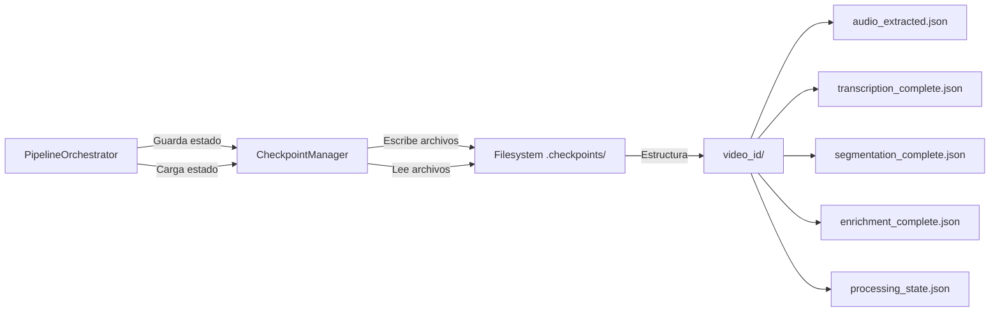

# Checkpointing Resumable

Sistema de checkpoints basado en filesystem que permite reanudar el pipeline desde cualquier punto de fallo sin perder trabajo previo.

**Propósito:** Implementar resiliencia y eficiencia permitiendo continuar procesamiento interrumpido sin repetir trabajo ya completado.

## Componentes Clave

| Componente | Responsabilidad | Archivo |
|------------|-----------------|---------|
| `CheckpointManager` | Gestiona operaciones de checkpoint | [`src/checkpoint/checkpoint_manager.py`](src/checkpoint/checkpoint_manager.py) |
| `PipelineOrchestrator` | Coordina checkpoints con ejecución | [`src/orchestrators/pipeline.py`](src/orchestrators/pipeline.py) |
| `PipelineState` | Representa estado del pipeline | [`src/utils/progress.py`](src/utils/progress.py) |

## Diagrama de Arquitectura



## Flujo de Operación

### Inicialización
1. **Generación de Video ID**: Hash del path + timestamp para identificación única
2. **Verificación de Checkpoints**: Buscar directorio `.checkpoints/<video_id>/`
3. **Determinación de Etapa**: Identificar última etapa completada exitosamente
4. **Salto de Etapas**: Omitir etapas ya completadas en la ejecución actual

### Guardado de Checkpoints
1. **Post-Etapa Exitosa**: Después de completar cada etapa principal
2. **Serialización de Estado**: Convertir objetos Pydantic a JSON
3. **Escritura Atómica**: Guardar en filesystem con nombres descriptivos
4. **Actualización de Estado**: Registrar etapa completada en `processing_state.json`

### Reanudación
1. **Carga de Estado**: Leer todos los archivos de checkpoint disponibles
2. **Validación de Integridad**: Verificar que los artefactos sean válidos
3. **Reconstrucción de Contexto**: Restaurar objetos necesarios para continuar
4. **Continuación**: Iniciar desde la primera etapa incompleta

## Estructura de Archivos

```
output/
└── .checkpoints/
    └── vid_a1b2c3d4_1686066600/
        ├── audio_extracted.json          # Audio extraído (metadata)
        ├── transcription_complete.json   # Transcripción completa con timestamps  
        ├── segmentation_complete.json    # Lista de capítulos con timestamps
        ├── enrichment_complete.json      # Metadata enriquecida por capítulo
        └── processing_state.json         # Estado general del pipeline
```

## Processing State Schema

```json
{
  "video_id": "string",
  "current_stage": "string",
  "completed_stages": ["string"],
  "providers_used": {
    "asr": "string",
    "llm": "string"
  },
  "cost_accumulated": "number",
  "timestamps": {
    "started_at": "string",
    "audio_extraction_completed": "string",
    "transcription_completed": "string",
    "segmentation_completed": "string",
    "enrichment_completed": "string"
  }
}
```

## Consideraciones de Implementación

- **Atomicidad**: Los checkpoints se guardan de forma atómica para evitar estados corruptos
- **Limpieza**: Los checkpoints se eliminan automáticamente al completar exitosamente
- **Persistencia**: El filesystem actúa como base de datos, cumpliendo el principio arquitectónico
- **Eficiencia**: Solo se guardan metadatos, no archivos binarios grandes
- **Compatibilidad**: La estructura de checkpoints es versionada para migraciones futuras

## Casos de Uso

- **Interrupción por Usuario**: Ctrl+C durante ejecución → reanudar después
- **Fallo de Proveedor**: Error API persistente → corregir config → reanudar
- **Problemas de Sistema**: Fallo de energía/sistema → continuar desde último checkpoint
- **Ajustes de Configuración**: Cambiar proveedor → reanudar desde etapa afectada

> **Filosofía:** "El trabajo ya completado es sagrado. Nunca se debe repetir procesamiento exitoso solo porque ocurrió un fallo posterior."