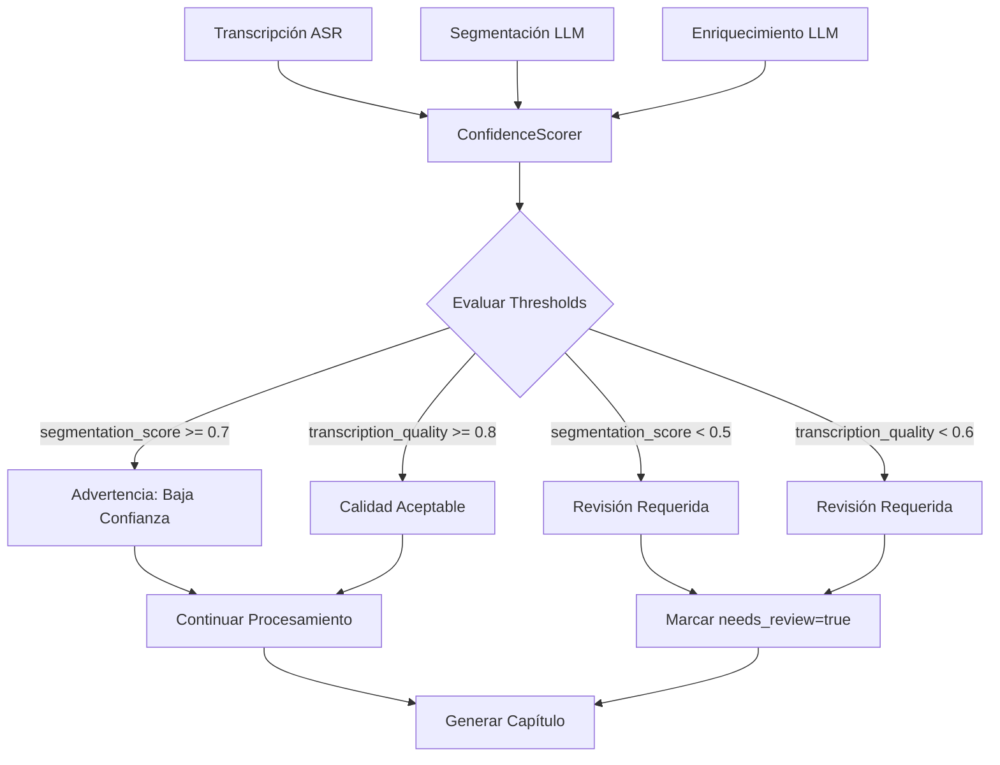

# Confidence Scoring

Sistema de puntuación de confianza que evalúa la calidad de la transcripción y segmentación para determinar cuándo se requiere revisión humana.

**Propósito:** Implementar el principio "El capítulo es la unidad atómica de valor" asegurando que solo se generen capítulos de calidad aceptable, con advertencias o requerimientos de revisión cuando sea necesario.

## Componentes Clave

| Componente | Responsabilidad | Archivo |
|------------|-----------------|---------|
| `ConfidenceScorer` | Calcula scores de confianza | [`src/intelligence/confidence_scorer.py`](src/intelligence/confidence_scorer.py) |
| `ChapterSegmenter` | Aplica thresholds de segmentación | [`src/processors/segmenter.py`](src/processors/segmenter.py) |
| `MetadataEnricher` | Aplica thresholds de enriquecimiento | [`src/processors/enricher.py`](src/processors/enricher.py) |
| `TUIRenderer` | Muestra advertencias en tiempo real | [`src/presentation/tui_renderer.py`](src/presentation/tui_renderer.py) |

## Diagrama de Arquitectura



## Métricas de Confianza

### Transcription Quality Score
- **Fuente**: Proveedor ASR (cuando disponible) + análisis interno
- **Factores**: 
  - Porcentaje de palabras con timestamps válidos
  - Presencia de muletillas/noise words
  - Coherencia gramatical básica
  - Duración vs palabras esperadas
- **Rango**: 0.0 - 1.0 (1.0 = máxima calidad)

### Segmentation Score  
- **Fuente**: Análisis interno de coherencia temática
- **Factores**:
  - Longitud del capítulo (muy corto/largo = baja confianza)
  - Coherencia semántica interna
  - Transiciones suaves con capítulos adyacentes
  - Diversidad de temas cubiertos
- **Rango**: 0.0 - 1.0 (1.0 = máxima coherencia)

### Content Coherence Score
- **Fuente**: Validación interna del contenido enriquecido
- **Factores**:
  - Completitud de campos requeridos
  - Coherencia entre descripción y bullets
  - Calidad de términos extraídos
  - Consistencia en highlights
- **Rango**: 0.0 - 1.0 (1.0 = máxima coherencia)

## Thresholds y Acciones

| Métrica | Umbral Advertencia | Umbral Revisión Requerida | Acción |
|---------|-------------------|--------------------------|--------|
| `segmentation_score` | < 0.7 | < 0.5 | Advertencia visible / `needs_review: true` |
| `transcription_quality` | < 0.8 | < 0.6 | Advertencia visible / `needs_review: true` |
| `content_coherence` | < 0.8 | < 0.7 | Advertencia visible / `needs_review: true` |

## Implementación en Metadata

```json
{
  "confidence": {
    "segmentation_score": 0.92,
    "transcription_quality": 0.88,
    "content_coherence": 0.95,
    "needs_review": false,
    "review_reasons": []
  }
}
```

Cuando `needs_review: true`:
```json
{
  "confidence": {
    "segmentation_score": 0.45,
    "transcription_quality": 0.72,
    "content_coherence": 0.81,
    "needs_review": true,
    "review_reasons": [
      "Low segmentation confidence (0.45 < 0.5 threshold)",
      "Manual review recommended for this chapter"
    ]
  }
}
```

## Display en TUI

- **Advertencias**: Mostradas en amarillo durante el procesamiento
- **Revisión Requerida**: Mostradas en rojo con mensaje específico
- **Resumen Final**: Reporte final incluye conteo de capítulos con advertencias/revisión requerida
- **Costos Impactados**: Los capítulos con baja confianza pueden requerir re-procesamiento manual

## Configuración

Los thresholds son configurables en código fuente (no en config.yaml) para mantener consistencia:

```python
CONFIDENCE_THRESHOLDS = {
    'segmentation_warning': 0.7,
    'segmentation_review': 0.5,
    'transcription_warning': 0.8, 
    'transcription_review': 0.6,
    'coherence_warning': 0.8,
    'coherence_review': 0.7
}
```

## Beneficios del Sistema

- **Calidad Garantizada**: Solo se generan capítulos que cumplen estándares mínimos
- **Transparencia**: El usuario sabe exactamente qué capítulos necesitan atención
- **Eficiencia**: Evita generar outputs de baja calidad que requerirían reprocesamiento
- **Auditoría**: Los scores permiten rastrear la calidad del sistema a lo largo del tiempo
- **Mejora Continua**: Los capítulos marcados para revisión pueden usarse para mejorar prompts/parámetros

> **Filosofía:** "La automatización debe ser honesta sobre sus limitaciones. Cuando la confianza es baja, el sistema debe pedir ayuda humana en lugar de generar basura."