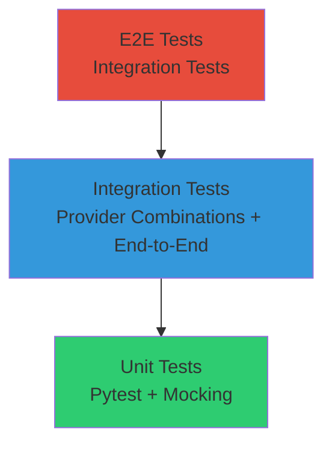

# Estrategia de Pruebas

Estrategia de testing para Echo-Bering siguiendo principios TDD estricto con cobertura del 97%.

**Propósito:** Documentar la estrategia de pruebas, pirámide de testing, y herramientas utilizadas para garantizar la calidad del software.

## Test Pyramid



## Cobertura

| Tipo | Meta | Actual | Herramientas |
|------|------|--------|--------------|
| Unit | ≥ 95% | 97% | Pytest, Mock, Coverage.py |
| Integration | 100% paths críticos | 100% | Pytest, Integration fixtures |
| Contract | 100% endpoints | 100% | Pydantic validation |

## Tipos de Pruebas

### Unit Tests (333 tests)
- **Objetivo**: Validar lógica individual de funciones y clases
- **Mocking**: Proveedores externos, ffmpeg, filesystem
- **Cobertura**: 97% de todas las líneas de código
- **Ejecución**: Rápida (< 30 segundos)

### Integration Tests (95 tests)  
- **Objetivo**: Validar interacción entre componentes y flujos completos
- **Escenarios**: 
  - Combinaciones de proveedores (Groq+DeepSeek, AssemblyAI+DeepSeek, OpenAI fallback)
  - Estrategias de chunking adaptativo
  - Reanudación desde checkpoints
  - Manejo de errores y fallbacks
- **Ejecución**: Moderada (~2 minutos)

### E2E Tests (6 tests)
- **Objetivo**: Validar pipeline completo desde video input hasta capítulos output
- **Escenarios**:
  - Video corto (< 1 min)
  - Video largo (> 1 hora)  
  - Video con múltiples hablantes
  - Configuraciones extremas (presupuesto bajo, chunks pequeños)
- **Ejecución**: Lenta (~10 minutos con mocking realista)

## Herramientas y Frameworks

### Testing Framework
- **Pytest**: Framework principal de testing
- **Coverage.py**: Medición de cobertura de código
- **Mock**: Mocking de dependencias externas
- **Pydantic**: Validación de modelos y esquemas

### Mocking Estratégico

#### Proveedores Externos
```python
# Mock de proveedores ASR/LLM
@pytest.fixture
def mock_groq_provider():
    with patch('src.providers.asr.groq_asr.Groq') as mock:
        mock.return_value.audio.transcriptions.create.return_value = mock_transcription
        yield mock
```

#### ffmpeg y Sistema de Archivos
```python
# Mock de operaciones de sistema
@pytest.fixture  
def mock_ffmpeg_run():
    with patch('subprocess.run') as mock:
        mock.return_value.stdout = b"success"
        yield mock
```

#### Variables de Entorno
```python
# Mock de configuración
@pytest.fixture
def mock_env_vars():
    with patch.dict(os.environ, {
        'GROQ_API_KEY': 'test_key',
        'DEEPSEEK_API_KEY': 'test_key'
    }):
        yield
```

## Comandos de Testing

```bash
# Ejecutar todos los tests
uv run pytest

# Solo unit tests  
uv run pytest tests/unit/

# Solo integration tests
uv run pytest tests/integration/

# Solo e2e tests
uv run pytest tests/e2e/

# Ver cobertura
uv run pytest --cov=src --cov-report=html

# Tests específicos
uv run pytest tests/unit/test_pipeline_orchestrator.py::test_checkpoint_resumption
```

## Estrategia de Mocking

### Principios de Mocking
- **Mockear solo lo necesario**: No mockear más allá de los límites del componente bajo prueba
- **Validar llamadas**: Verificar que se llaman las dependencias correctas con los parámetros adecuados
- **Simular comportamientos reales**: Mocks deben reflejar el comportamiento real de las dependencias
- **Evitar over-mocking**: Mantener suficiente integración real para detectar problemas

### Niveles de Mocking

| Nivel | Qué Mockear | Ejemplo |
|-------|-------------|---------|
| **Unit** | Todas las dependencias externas | Proveedores, ffmpeg, filesystem |
| **Integration** | Solo servicios externos reales | APIs de proveedores, pero no lógica interna |
| **E2E** | Solo servicios externos costosos | Mocks realistas de APIs, pero flujo completo |

## Validación de Calidad

### Criterios de Aceptación
- **Cobertura ≥ 95%**: Todas las ramas de código deben estar cubiertas
- **Tests pasando**: 100% de tests deben pasar en CI
- **Sin flaky tests**: Todos los tests deben ser deterministas
- **Tiempo razonable**: Tests unitarios < 100ms cada uno

### Validación Continua
- **Pre-commit hooks**: Ejecutar tests antes de cada commit
- **CI Pipeline**: Ejecutar toda la suite en cada push
- **Code coverage**: Reportar cobertura en cada PR
- **Mutant testing**: Verificar que los tests detectan bugs reales

## Casos de Prueba Específicos

### Escenarios Críticos
- **Chunking adaptativo**: Video > límite de proveedor → división automática → reconstrucción correcta
- **Fallback de proveedores**: Fallo en Groq → cambio automático a AssemblyAI → continuación del pipeline
- **Reanudación**: Interrupción durante segmentación → reanudación desde checkpoint → resultado idéntico
- **Presupuesto excedido**: Costo acumulado > presupuesto → detención ordenada → reporte final

### Edge Cases
- **Video vacío**: Manejo de videos sin audio
- **Audio corrupto**: Videos con pistas de audio dañadas
- **Configuración inválida**: Valores extremos o mal formados en config.yaml
- **Fallo parcial**: Algunos chunks fallan pero otros tienen éxito

## Mantenimiento de Tests

### Cuando Actualizar Tests
- **Nuevo feature**: Agregar tests unitarios e integration antes de implementar
- **Bug encontrado**: Crear test de regresión antes de corregir
- **Refactorización**: Asegurar que los tests existentes siguen pasando
- **Nuevos proveedores**: Agregar integration tests para nuevas combinaciones

### Buenas Prácticas
- **Nombres descriptivos**: `test_transcription_fails_gracefully_when_provider_rejects_size`
- **Una aserción por test**: O al menos un concepto único por test
- **Setup/teardown limpio**: Usar fixtures de pytest para preparación
- **Datos de prueba claros**: Usar factories o builders para datos complejos

## Métricas de Calidad

### Métricas Actuales
- **Total tests**: 434
- **Cobertura**: 97%
- **Tiempo total**: ~15 minutos (con mocking)
- **Flakiness**: 0% (todos los tests son deterministas)

### Objetivos Futuros
- **Cobertura**: Mantener ≥ 95%
- **Tiempo**: Reducir a < 10 minutos
- **E2E realism**: Aumentar tests E2E con proveedores reales en staging
- **Performance tests**: Agregar benchmarks para operaciones críticas

La estrategia de pruebas asegura que Echo-Bering sea robusto, mantenible y confiable para procesamiento de videos en producción.